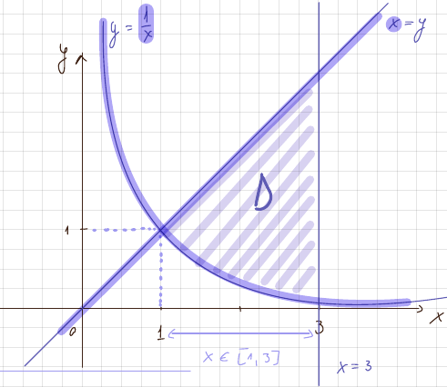
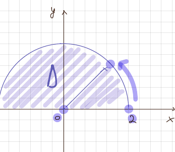
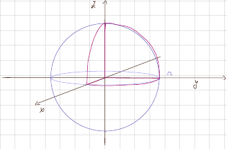
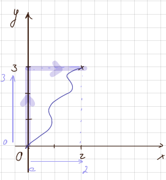
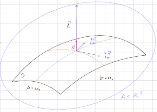
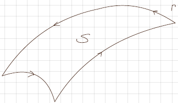

## Paraméteres integrál

### Egyismeretlenes

Pl:
$f(a) = \int_0^\frac{\pi}{2} ln\frac{1+a\cos x}{1-a\cos x} * \frac{f}{\cos x}dx = ?; |a|<1 \Rightarrow -1 < a < 1\\
f'(a) = \int_0^{\frac{\pi}{2}}(ln \frac{1+a\cos x}{1-a\cos x})'_a \frac{dx}{\cos x} = \dots = \frac{\pi}{\sqrt{1-a^2}}\\
f(a) = \int f'(a) da = \int\frac{\pi}{\sqrt{1-a^2}} = \pi \arcsin a+ C$ C-t még meg kell határozni  
$f(0) = 0 \Rightarrow f(0) = \pi\arcsin 0 + C = - \Rightarrow C = 0 \Rightarrow f(a) = \pi\arcsin a$

### Kétismeretlenes

Pl:

$f(a,b) = \int_0^{\infty}\frac{e^{-a^2x^2}-e^{-b^2x^2}}{x}dx = ?\\[12pt]\frac{\partial f}{\partial a} = \int_0^{\infty}(e^{-a^2x^2}-e^{b^2x^2})'_a\frac{dx}{x}=\dots=-\frac{1}{a}\\
f(a,b) = \int\frac{\partial f}{\partial a}da = -\ln a+\bold{\underline{C(b)}} \leftarrow\text{ még ki kell számolni}\\[6pt]
f(b,b) = 0 \Rightarrow f(b,b) = -\ln b + C(b) = 0 \Rightarrow C(b) = \ln b \Rightarrow f(a,b) = -\ln a + \ln b(*) = ln\frac{b}{a}$
\*: C(b)

## Inproprius integrál

$\lim_{b\to\infty}\int_a^bf(x) dx = L, \text{ ha L véges} \Rightarrow \text{ konvergens}$
Jel: $L = \int_a^{\infty}f(x)dx$  
$\int_1^{\infty}f(x)dx = \lim_{t\to\infty}\int_1^tf(x)dx \leftarrow$ így kell kiszámolni  
pl: $\int_1^{\infty}\frac{x}{(x^2+2)^2}dx=\lim_{t\to\infty}\int_1^t\frac{x}{(x^2+2)^2}dx=\lim_{t\to\infty}\frac{-1}{2(x^2+2)}\Big|_1^t = \frac{1}{6}$

Konvergencia kritérium: ha az integrál kiszámolása nélkül kell a konvergens/divergens
Ha $\lim_{x\to\infty}x^L*f(x)=l\quad, l\in\mathbb{R}^*\\[6pt]
L > 1 \Rightarrow \int_1^{\infty}f(x)dx \text{ konvergens}\\
L \le 1 \Rightarrow \int_1^{\infty}f(x)dx \text{ divergens}
$

pl:

$f(x) = \frac{x}{(x^2+2)^2}\\
\lim_{x\to\infty}x^3f(x)=\lim_{x\to\infty}\frac{x^4}{x^4+4x^2+4} = 1\\
L = 3 > 1 \Rightarrow f(x) \text{ konvergens}
$

## Dupla integrál

Pl:

$\underset{D}{\iint}4xy\,dx\,dy=?\\[6pt]
D: \begin{cases}y=x\\y=\frac{1}{x}\\x=3\end{cases}$

$\int_1^3(\int_{\frac{1}{x}}^x 4xy\,dy)dx$

Pl:

$\underset{D}{\iint}x^2\sqrt{(x^2+y^2)^3}\,dx\,dy\\
D:\begin{cases}x^2+y^2 \le 4\\ y\ge0\end{cases}$

### Polár koordináta

$\begin{cases}x =r\cos\Theta\\y =r\sin\Theta\end{cases}\qquad ,dx\,dy = \underline{r}(*)dr\,d\Theta\qquad,r\in[0,R]$

\*: det I

$\underset{d}{\iint}\underline{(r\cos\Theta)^2}(*)\sqrt{[\underline{(r\cos\Theta)^2}(*) + \underline{(r\sin\Theta)^2}(**)]^3}*\underline{r\,dr\,d\Theta}(***) = \int_0^2(\int_0^2r^6 \cos^2\Theta \, d\Theta)dr\\[12pt]\Theta\in[0,\pi]$

\*: $x^2$  
**: $y^2$  
\***: dxdy

## Tripla integrál

### Gömbi koordináta

$\begin{cases}x = r*\cos\varphi\sin\Theta\\y=r*\sin\varphi\sin\Theta\\z=r*\cos\Theta\end{cases}\quad,\det I = r^2*\sin\Theta\quad,r\in[0,R]$

$\text{gömb:} \qquad x^2+y^2+z^2 = R^2\\R\in[0,r]$

Pl:
$
I = 
\underset{C}{\iiint}\sqrt{x^2+y^2+z^2}\,dx\,dy\,dz = 
\iiint\sqrt{\underline{(r\cos\varphi\sin\Theta)^2}(*)+\underline{(r\sin\varphi\sin\Theta)^2}(**)+\underline{(r\cos\Theta)^2}(***)} \underline{r^2\sin\Theta}\, dr\, d\varphi\, d\Theta = \dots \\\ [0,r]x[0,\frac{\pi}{2}]x[0,\frac{\pi}{2}]
$

## Görbe ívhossza (görbe grafikonjának a hossza)

Ha $r: \qquad x = x_{(t)}, y = y_{(t)}, z = z_{(t)}\quad; t\in[a,b]\\
L(r) =\int_a^b\sqrt{(x'_{(t)})^2+(y'_{(t)})^2+(z'_{(t)})^2}\,dt$

Ha

$f:[a,b]\rightarrow\mathbb{R}\quad f(x) =\dots\\L(f)=\int_a^b\sqrt{1+(f'(x))^2}\,dx$

## Elsőfajú görbementi integrál

r - a görbe jele

$y=f(x)\qquad,x\in[a,b]\\
L(f) = \int_a^b\sqrt{1+(f'(x))^2}\,dx$

$\int_rf(x,y,z)\,\underline{ds} \leftarrow\text{ ívhossz elem}\\ds = \sqrt{(x'_{(t)})^2 + (y'_{(t)})^2+ (z'_{(t)})^2}\,dt$

Pl:\
$\int_r(x^2+y^2)\ln z\,ds = ?\\[12pt]
r:\begin{cases}x = e^t\cos t\\y =e^t\sin t\\z=e^t\end{cases}\qquad t\in[0,1]\\[24pt]
\begin{rcases}x'_{(t)}=e^t(\cos t-\sin t)\\
y'_{(t)} =e^t(\sin t+\cos t)\\
z'_{(t)}=e^t\end{rcases}\Rightarrow ds=e^t\sqrt{3}dt$

$\int_0^1[\underline{(e^t\cos t)^2}(*) +\underline{(e^t\sin t)^2}(**)]\underline{\ln e^t}(***)*\underline{e^t\sqrt{3}}(****)\,dt\\[6pt]\uparrow$
Az integrál a és b-je a $t$ a és b-je\
\*: $x^2$\
**: $y^2$\
\***: $\ln z$\
\*\*\*\*: ds

## Másodfajú görbementi integrál

### Ha függ az úttól

Pl:\
$I = \int_r\underline{(y^2-z^2)}(*)dx\,+\underline{2yz}(**)\,dy-\underline{x^2}(***)dz = ?$

\*: P\
**: Q\
\***: R\

$\begin{rcases}\frac{\partial P}{\partial y}= \frac{\partial Q}{\partial x}\\
\frac{\partial P}{\partial z} = \frac{\partial R}{\partial x}\\
\frac{\partial Q}{\partial z} = \frac{\partial R}{\partial y}\end{rcases}\text{ Ha igazak függ az úttól, ha nem, akkor nem függ}$

$r:\begin{cases}x = t\\y=t^2\\z = t^3\end{cases}\quad, t\in[0,1]\qquad \begin{aligned}&dx=x'_{(t)}dt = dt\\
&dy=y'_{(t)}dt = 2t\,dt\\
&dz = z'_{(t)}\,dt = 3t^2dt\end{aligned}\\[24pt]I = \int_0^1\underline{(t^4 - t^6)}(*)\underline{dt}(**)+\underline{2t^2*t^3}(***)\underline{*2t\,dt}(****)\underline{-t^2}(*****)\underline{3t^2\,dt}(******)=\dots$

\*: $y^2-z^2$  
**: dx  
\***: 2yz  
\***\*: dy  
\*\*\***: $-x^2$  
**\*\***: dz

### Ha nem függ az úttól

**_a. egyik módszer:_**  
pl: $I=\int_{(0,0)}^{(2,3)}\underline{(x+y)}(*)dx +\underline{(x-y)}(**)dy = ?$
\*: P  
\*\*: Q

$\frac{\partial P}{\partial y} = \frac{\partial Q}{\partial t} \Rightarrow 1 = 1 \text{ igaz } \Rightarrow \text{ nem függ}$

$I = \int_0^3\underline{0-y}(*)\,dy+\int_0^2\underline{x+3}(**)\,dx$

\*: függőlegesen 0-tól 3-ig, itt x = 0, mert 0-an van a függőleges  
\*\*: vízszintesen 0-tól 2-ig, itt y = 3, mert 3-ban van vízszintesen

**_b. másik módszer (ez könnyebb, főleg ha x,y,z van)_**

pl: $I = \int_{(1,1,1)}^{(2,3,-4)}\underline{x\,dx}(*)+\underline{y^2\,dy}(**)-\underline{z^3\,dz} = ?\\[24pt]\begin{rcases}\frac{\partial P}{\partial y} = \frac{\partial Q}{\partial x}\qquad 0=0\\\frac{\partial P}{\partial z}= \frac{\partial R}{\partial x}\qquad 0=0\\\frac{\partial Q}{\partial z} = \frac{\partial R}{\partial y}\qquad 0=0\end{rcases}\Rightarrow \text{ nem függ}$

$H(x,y,z)=\int_{x_0}^xP(i,y,z)\,du + \int_{y_0}^yQ(x_0, v, z)\,dv+\int_{z_0}^zR(x_0,y_0, s)\,ds = \frac{x^2}{2}-\frac{x_0^2}{2}+\frac{y^3}{3}-\frac{y_0^3}{3}-\frac{z^4}{4}+\frac{z_0^4}{4}=\frac{x^2}{2}+\frac{y^3}{3}-\frac{z^4}{4}+C\\[6pt]
I = H(2,3,-4)-H(1,1,1)=\dots
$

## Green képlet (zárt görbék esetén)

$\int_rPdx + Qdy = \underset{D}{\iint}(\frac{\partial Q}{\partial x}-\frac{\partial P}{\partial y})dxdy$

pl:  
$\int_r\underline{(x+y)}(*)dx-\underline{(x-y)}(**)dy = ?\\[6pt]
r: \frac{x^2}{a^2}+\frac{y^2}{b^2} = 1 \qquad T_{ellipszis} = a*b*\pi\\[6pt]
\begin{cases}x = a*r*\cos\Theta\\ y=b*r*\cos\Theta\end{cases} \quad r\in[0,1]\\[12pt]\underset{D}{\iint}(\frac{\partial Q}{\partial x}-\frac{\partial P}{\partial y})dxdy = -2\underline{\underset{D}{\iint}dxdy}(*)=-2\int_0^{25?}[\int_0^1(-abr)dr]d\Theta = \dots
$

## Felület darabterülete

Ha S:$\begin{cases}x = x(u,v)\\y=y(u,v)\\z=z(u,v)\end{cases}\qquad,(u,v)\in D$

$E = (\frac{\partial x}{\partial u})^2 + (\frac{\partial y}{\partial u})^2 + (\frac{\partial z}{\partial u})^2\\[6pt]
F = \frac{\partial^2x}{\partial u \partial v}+\frac{\partial^2y}{\partial u \partial v}+\frac{\partial^2z}{\partial u\partial v}\\[6pt]
G = (\frac{\partial x}{\partial v})^2+(\frac{\partial y}{\partial v})^2+(\frac{\partial z}{\partial v})^2\\[6pt]T_{(S)} = \underset{D}{\iint}\sqrt{EG-F^2}du\,dv \leftarrow \text{ felület területe}$

Ha S: $\begin{cases}z=z(x,y)\\x=u\\y=z\end{cases}\qquad(x,y)\in D$

$T_{(S)}=\underset{D}{\iint}\sqrt{1+(\frac{\partial z}{\partial x})^2+(\frac{\partial z}{\partial y})^2}dx\,dy \leftarrow \text{ felület területe}$

## Elsőfajú felületi integrál

$f: D\rightarrow\mathbb{R}\qquad\text{folytonos}, S\subset D\subset\mathbb{R}^3$

S:\
$x=x(u,v)\\y=y(u,v)\qquad(u,v)\in\Omega\\z=z(u,v)$

$\underset{S}{\iint}f(x,y,z)d\nabla=\underset{\Omega}{\iint}f(x_{(u,v)},y_{(u,v)},z_{(u,v)})*\sqrt{EG-F^2}\,dudv$

pl: $I=\underset{S}{\iint}(x+y+z)d\nabla = ?$  
d$\gamma$ = $\sqrt{EG-F^2}$ - felület területe

S: $x^2+y^2+z^2 =a^2, z\ge0\leftarrow\text{ gömb}$  
$\begin{cases}z = \sqrt{a^2-x^2-y^2} = z(x,y)\\x=x\\y=y\end{cases}x,y\in D\\[16pt]I=\underset{D}{\iint}(x+y+\sqrt{a^2-x^2-y^2})*\sqrt{1+(\frac{\partial z}{\partial x})^2+(\frac{\partial z}{\partial y})^2}\,dxdy=\dots$

## Másodfajú felületi integrál

S:$\begin{cases}x = x(u,v)\\y=y(u,v)\\z=z(u,v)\end{cases}\qquad;(u,v)\in D\subset\mathbb{R}^3$

x(u,v);y(u,v);z(u,v) folytonos függ.

$\vec{r}(u,v)=\vec{i}x(u,v)+\vec{j}y(u,v)+\vec{k}z(u,v)$
$\vec{N}=\frac{\partial \vec{r}}{\partial u}(u_0,v_0)*\frac{\partial\vec{r}}{\partial v}(u_0,v_0)=\begin{bmatrix}\vec{i}&&\vec{j}&&\vec{k}\\\frac{\partial x}{\partial u}&&\frac{\partial y}{\partial u}&&\frac{\partial z}{\partial u}\\[3pt]\frac{\partial x}{\partial v}&&\frac{\partial y}{\partial v}&&\frac{\partial z}{\partial v}\end{bmatrix}=\vec{i}A+\vec{j}B+\vec{k}C$

A = $\begin{bmatrix}\frac{\partial y}{\partial u}&&\frac{\partial z}{\partial u}\\[3pt]\frac{\partial y}{\partial v}&&\frac{\partial z}{\partial v}\end{bmatrix}$ B = $\begin{bmatrix}\frac{\partial z}{\partial u}&&\frac{\partial x}{\partial u}\\[3pt]\frac{\partial z}{\partial v}&&\frac{\partial x}{\partial v}\end{bmatrix}$ C = $\begin{bmatrix}\frac{\partial x}{\partial u}&&\frac{\partial y}{\partial u}\\[3pt]\frac{\partial x}{\partial v}&&\frac{\partial y}{\partial v}\end{bmatrix}$

$\vec{n} = \frac{\vec{N}}{||\vec{N}||}=\vec{i}\frac{A}{\sqrt{A^2+B^2+C^2}}(*)+\vec{j}\frac{B}{\sqrt{A^2+B^2+C^2}}(**)+\vec{k}\frac{C}{\sqrt{A^2+B^2+C^2}}(***)\\[16pt]
*: \cos\alpha\\
**: \cos\beta\\
***: \cos\gamma\\[24pt]
\alpha = m(\vec{n},\vec{ox})\\
\beta = m(\vec{n},\vec{oy})\\\gamma = m(\vec{n},\vec{oz})\\\vec{n}=\vec{i}*\cos\alpha+\vec{j}*\cos\beta+\vec{k}*\cos\gamma\\[24pt]\underset{S}{\iint}(P\cos\alpha+Q\cos\beta+R\cos\gamma)d\nabla =\,? \leftarrow \text{ Ezt kell kiszámolni}\\
=\underset{S}{\iint}P\cos\alpha d\nabla+\underset{S}{\iint}Q\cos\beta d\nabla+\underset{S}{\iint}R\cos\gamma d\nabla\\[6pt]\cos\alpha = \frac{A}{\sqrt{A^2+B^2+C^2}} = \frac{A}{\sqrt{EG-F^2}}\\[6pt]\underset{S}{\iint}P\cos\alpha d\nabla = \underset{D}{\iint}P\frac{A}{\sqrt{EG-F^2}}\sqrt{EG-F^2}\,du\,dv=\underset{D}{\iint}PA\,du\,dv\\[6pt]
\text{S:}\begin{cases}x=h(y,z)\\y=y=u\\z=z=v\end{cases}\qquad y,z\in D\\[6pt]
\underset{S}{\iint}P\cos\alpha d\nabla = \underset{D}{\iint}P(x_{(y,z)},y,z)\,dy\,dz
$

pl: S: $x^2+y^2+z^2=a^2$ a sugarú gömb

$\underset{S}{\iint}(x\cos\alpha+y\cos\beta+z\cos\gamma)d\nabla =\,?\\[6pt]\vec{N} = \vec{i}x+\vec{j}y+\vec{k}z\\[6pt]\vec{n}=\frac{\vec{N}}{||\vec{N}||}=\vec{i}\frac{x}{\sqrt{x^2+y^2+z^2}}+\vec{j}\frac{y}{\sqrt{x^2+y^2+z^2}}+\vec{k}\frac{z}{\sqrt{x^2+y^2+z^2}}\\[6pt]I=\underset{S}{\iint}\frac{x^2+y^2+z^2}{\sqrt{x^2+y^2+z^2}}d\nabla = \underset{S}{\iint}\sqrt{x^2+y^2+z^2}d\nabla=a\underset{S}{\iint}d\nabla = a*Ter(s)=a*4a^2\pi=4\pi a^3$

## Gauss - Osztrogradszkij

$D\subset\mathbb{R}^3\quad,F:D\rightarrow\mathbb{R}^3\quad,F=(P,Q,R)$
**Képlet:**  
$$\underset{S}{\iint}P\cos\alpha+Q\cos\beta+R\cos\gamma d\nabla=\underset{T}{\iiint}(\frac{\partial P}{\partial x}+\frac{\partial Q}{\partial y}+\frac{\partial R}{\partial z})\,dx\,dy\,dz$$

pl:  
$\underset{S}{\iint}x\cos\alpha+y\cos\beta+z\cos\gamma d\nabla=\underset{Gömb}{\iiint}(\frac{\partial P}{\partial x}+\frac{\partial Q}{\partial y}+\frac{\partial R}{\partial z})dx\,dy\,dz = 3\underset{Gömb}{\iiint}dx\,dy\,dz=3*Térf(Gömb)=3*\frac{4\pi a^3}{3}=4\pi a^3$

## Stokes

$F*:D\rightarrow\mathbb{R}^3\quad,F*=(P,Q,R),\quad S\in D\\[6pt]\int_rPdx+Qdy+Rdz=\underset{S}{\iint}\begin{bmatrix}\cos\alpha&&\cos\beta&&\cos\gamma\\[3pt]\frac{\partial}{\partial x}&&\frac{\partial}{\partial y}&&\frac{\partial}{\partial z}\\P&&Q&&R\end{bmatrix}d\nabla\\[12pt]\int_r Pdx+Qdy+Rdz=\underset{S}{\iint}(\frac{\partial R}{\partial y}-\frac{\partial Q}{\partial z})\cos\alpha+(\frac{\partial P}{\partial z}-\frac{\partial R}{\partial x})\cos\beta+(\frac{\partial Q}{\partial x}-\frac{\partial P}{\partial y})cos\gamma\,d\nabla$

