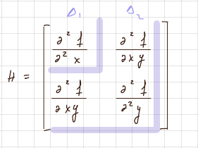
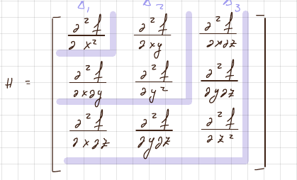

# Sorozatok és sorok

$\sum_{n = 1}^{\infty} a_n$

### D'Alembert

$\sum_{n = 1}^{\infty} a_n, \space a_n > 0$  
$\lim_{n\to\infty} = \frac{a_{n+1}}{a_n} = g$  
g < 1 => konvergens  
g = 1 => nem lehet eldönteni  
g > 1 => divergens

### Cauchy gyökkritérium

$\lim_{n\to\infty} \sqrt[n]{a_n} = l$  
l < 1 => konvergens  
l = 1 => nem lehet eldönteni  
l > 1 => divergens

### Raabe

$\lim_{n\to\infty} n*(\frac{a_{n+1}}{a_n} * 1) = l$  
l < -1 => konvergens  
l = -1 => nem lehet eldönteni  
l > -1 => divergens

### Leibnitz

$\sum_{n=1}^{\infty}(-1)^n * a_n$, ha $(a_n)_{n\geq1}$ csökkenő és $\lim_{n\to\infty} a_n = 0$ => konvergens

Csökkenő tesztelése:  
$a_n - a_{n+1} > 0$ => csökkenő  
$\frac{a_n}{a_{n+1}} > 1$ => csökkenő

## Hatványsorok

$$
\sum_{n=1}^{\infty} a_n*(x - x_0)^n \\[12pt]
\frac{1}{R} = \lim_{n\to\infty}\sqrt[n]{|a_n|}\\[12pt]
\frac{1}{R} = \lim_{n\to\infty} |\frac{a_{n+1}}{a_n}| (*)
$$

\*Inkább ezt lehet használni  
R - konvergencia sugár  
| x - x$_0$ | < R => konvergens -> megnézem a határokat, hogy konv/div  
| x - x$_0$ | > R => divergens

## Iterált határérték

$\lim_{y\to y_0}(\lim_{x\to x_0}f_{(x, y)}) = l_1\\
\lim_{x\to x_0}(\lim_{y\to y_0}f_{(x, y)}) = l_2$  
Ha $l_1 \neq l_2$ => nem létezik f határértéke. Ez szükséges, de nem elég ahhoz, hogy tudjuk, hogy létezik a hatérték vagy sem.  
Pl:

$$
\lim_{\substack{x\to 1\\ y\to 0}} = \frac{sin (x+ y - 1}{x - y} = \space?\\[10pt]
\lim_{y\to 0}\space(\lim_{x\to 1}\frac{sin(x +y -1)}{x - y})= \lim_{y\to 0} \frac{sin y}{1-y} = 0\\[10pt]
\lim_{x\to 1}\space(\lim{y\to 0} \frac{sin(x+y-1)}{x-y}) = \lim_{x\to 1} \frac{sin x-1}{x} = 0\\[15pt]
\downarrow\\
\text{Létezhet a határérték, } l_1 = l_2
$$

$(1, 0)\quad y - 0 = m(x-1) => y = m(x-1)\\
\text{Ha } x \rightarrow 1 => y \rightarrow 0\\[12pt]
\lim_{x\to 1}\frac{sin[x-m(x-1)-1]}{x-m(x-1)} = 0 \Rightarrow \lim_{\substack{x\to 1\\ y\to 0}}\frac{sin(x+1-1)}{x-y} = 0
$

## Minimum / Maximum pont

$f(x,y) = x^3 + 3xy^2 - 15x - 12y + 4 \qquad x, y >0\\[6pt]
\begin{aligned}&\frac{\partial f}{\partial x} = 3x^2 + 3y^2 - 15\\[6pt]&\frac{\partial f}{\partial y} = 6xy - 12\end{aligned}
 \Rightarrow
\begin{cases}3x^2+3y^2 - 15 = 0\\6xy-12 = 0
\end{cases} \Rightarrow \begin{cases}x = 2\\y=1\end{cases} \Rightarrow A(2,1) \text{ stacionárius pont}\\
\frac{\partial ^2 f}{\partial x^2} = 6x \Rightarrow \frac{\partial ^2 f}{\partial x^2}(A) = 12\\[6pt]
\frac{\partial f}{\partial y^2} = 6x \Rightarrow \frac{\partial f}{\partial y^2}(A) = 12\\[6pt]
\frac{\partial f}{2x2y} = 6y \Rightarrow \frac{\partial f}{2x2y}(A) = 12
$

$\Delta_1 > 0, \Delta_2>0, \Delta_3 > 0 \qquad \text{minimum pont}\\ \Delta_1 < 0, \Delta_2 > 0, \Delta_3 < 0 \qquad \text{maximum pont}$

### Ha van plusz feltétel is:

Pl: $u_{(x, y,z)} = x + y + z \qquad ,F=x^2+y^2+z^2 = \underline{1} \leftarrow \text{mellék feltétel}\\
L_{(x,y,z,\lambda)} = x+y+z + \lambda *(x^2 + y^2+z^2 - 1)$

$\begin{aligned}
&\frac{\partial L}{\partial x} = 1 + 2\lambda x\\
&\frac{\partial L}{\partial y} = 1 + 2 \lambda y\\
&\frac{\partial L}{\partial z} = 1+2\lambda z\\
&\frac{\partial L}{\partial \lambda} = x^2+y^2+z^2-1
\end{aligned}\begin{cases}1+2\lambda x = 0\\1+2\lambda y = 0\\1+2\lambda z = 0\\x^2+y^2+z^2 - 1 = 0 (*)\end{cases}\Rightarrow x = y = z = \frac{-1}{2\lambda}*\Rightarrow \frac{3}{4\lambda ^2} = 1 \Rightarrow \lambda = \pm \frac{\sqrt{3}}{2}\\
*: \text{Behelyettesítjük a nevezőbe}
$
Ha $\lambda = \frac{\sqrt{3}}{2} \Rightarrow x = y = z = \frac{-1}{\sqrt{3}}\Rightarrow A(\frac{-1}{\sqrt{3}},\frac{-1}{\sqrt{3}},\frac{-1}{\sqrt{3}}) \text{ stacionárius pont}$

$
\frac{\partial ^2L}{\partial x^2} = 2\lambda = \sqrt{3} \qquad \frac{\partial^2L}{\partial x\partial y} = 0\\[6pt]
\frac{\partial ^2L}{\partial x^2} = 2\lambda = \sqrt{3} \qquad \frac{\partial^2L}{\partial x\partial z} = 0\\[6pt]
\frac{\partial ^2L}{\partial x^2} = 2\lambda = \sqrt{3} \qquad \frac{\partial^2L}{\partial y\partial z} = 0
$

Ha az eredményben lett volna x, y, z a stac. pontból helyettesítesz be.

### L másodrendű differenciál függvénye

$d^2L = \frac{\partial^2L}{\partial x^2}h_1^2+\frac{\partial^2L}{\partial y^2}h_2^2 + \frac{\partial^2L}{\partial z^2}h_3^2 + \frac{\partial^2L}{\partial x\partial y}h_1h_2 + \frac{\partial^2L}{\partial x\partial z}h_1h_3 + \frac{\partial^2L}{\partial y\partial z}h_2h_3\\
d^2L = \sqrt{3}*(h_1^2 + h_2^2+h_3^2) \qquad > 0 \Rightarrow \text{ pozitív definit} \Rightarrow \text{ minimum pont}
$

pozitív definit => minimum pont\
negatív definit => maximum pont

Ha nem lehet eldönteni, hogy pozitív vagy negatív a mellék feltételt differenciálhatjuk és kifejezzük belőle $h_3$-at ( vagy egy másik $h$-t), amit behelyettesítünk $d^2L$-be  
Mellék feltétel differenciálja:  
$\frac{\partial F}{\partial x}h_1 + \frac{\partial F}{\partial x}h_2+\frac{\partial F}{\partial x}h_3 = 0$

Ha ezután sem lehet eldönteni, hogy pozitív vagy negatív definit, akkor indefinit => nincs szélsőérték pont

## Taylor sorba fejtés

$f:(a,b) \rightarrow \mathbb{R} \qquad p+1\text{-szer deriválható}\\
f(x) = f(x_0) + \frac{f'(x_0)}{1!}(x-x_0) + \frac{f''(x_0)}{2!}(x-x_0)^2 + \dots\frac{f^{(n+1)}(x_0)}{(n+1)!}(x-x_0)^{n+1}$

pl:

$f(x) = \frac{1}{2-3x+x^2} = \frac{1}{x-2} - \frac{1}{x-1}\\
f'(x)=\\
f''(x) =\\
\vdots
f^n(x) = \downarrow \text{ behelyettesítek és kiszámolom}\\
f(x) = f(0) + \frac{f'(0)}{1!}x + \frac{f''(0)}{2!}x^2 + \dots = \frac{1}{2}+(1- \frac{1}{2^2})x +(1-\frac{1}{2^3})x^2\dots+\bold{(1-\frac{1}{2^{n+1}})x^n} \leftarrow a_n
$

Ha megkell nézni, hogy konvergens vagy divergens:

$R = \lim_{n\to\infty} \frac{a_n}{a_{n+1}} = 1\\
|x| < R \Rightarrow \quad x\in(-1, 1) \text{ konvergens}
$

Lehet ilyen feladat is:

$f(x) = \frac{1}{(1-x+x^2)}\qquad f^5(0) = ?\\[6pt]f(x) =\frac{(1+x)^2}{(1+x)^2(1-x+x^2)^2} = \frac{(1+x)^2}{[(1+x)(1-x+x^2)]^2} = \frac{(1+x)^2}{[1^3 + x^3]^2} = (1+2x+x^2)*\frac{1}{(1+x^3)^2} = (+x)^2\frac{1}{(1+x^3)^2}\\[12pt]
(\frac{1}{1-t})' = \frac{-1(1-t)'}{(1-t)^2} = \frac{+1}{(1-t)^2}\\[6pt]
(1+t+t^2+\dots+t^n) = 0 + 1 + 2t=3t^2+\dots+nt^{n-1}+\dots\\
t = -x^3\\[6pt]
\frac{1}{(1+x^3)^2} = 0+1+2t+3t^2+\dots+nt^{n-1} /*(1+x)^2\\[6pt]
f(x) \rightarrow[\bold{(1+x)^2\frac{1}{(1+x^3)^2}}] = (1+x)^2*(0+1-2x^3+3x^6-4x^9+\dots) = 1+2x+x^2 -2x^4 - 4x^4 - \bold{2x^5} + 3x^6 + \dots\\
\frac{f^5(0)}{5!} = -2 \Rightarrow f^5(0) = -240
$

## Taylor sorbafejtés többváltozós függvény esetén

$f(x,y) = ln(x^2 +3y) \qquad Taylor(1,0)[(a,b)]\\[6pt]\frac{\partial f}{\partial x} = \frac{2x}{x^2+3y}\\[6pt]
\frac{\partial f}{\partial y} = \frac{3}{x^2+3x}\\[6pt]
\frac{\partial ^2 f}{\partial x^2} = \frac{-2x^2 + 6y}{(x^2 + 3y)^2}\\[6pt]
\frac{\partial ^2 f}{\partial y^2} = \frac{-9}{(x2+3y)^2}\\[6pt]
\frac{\partial ^2 f}{\partial x \partial y} = \frac{-6x}{(x^2 + 3y)^2}
$

Taylor sor:

$f(x,y) = f(a,b) + \frac{1}{1!}[\frac{\partial f}{\partial x}(a,b)(x-a)+\frac{\partial f}{\partial y}(a, b)(y-b)] + (\leftarrow \text{első elem, második elem} \rightarrow) + \frac{1}{2!}[\frac{\partial^2f}{\partial x^2}(a,b)(x-a)^2 + 2\frac{\partial ^2f}{\partial x \partial y}(a,b)(x-a)(y-b)+\frac{\partial^2f}{\partial y^2}(a,b)(y-b)^2] + \dots\\[6pt]
f(x,y) \simeq 2(x-1)+3y-(x-1)^2-6(x-1)y-\frac{9}{2}y^2\dots \qquad \text{ ilyen alakban kell hagyni}$

## Fourier sor

$f:[-l,l] \rightarrow \mathbb{R} \qquad\text{periodikus függvény}\\[6pt]
f(x) = \frac{a_0}{2}+\sum_{n = 1}^{\infty}(a_n*cos\frac{n\pi x}{l}+b_n*sin\frac{n\pi x}{l})\\[12pt]
a_0 = \frac{1}{l}\int_{-l}^lf(x)dx\\
a_n = \frac{1}{l}\int_{-l}^{l}f(x)*cos\frac{n\pi x}{l}dx\\
b_n = \frac{1}{l}\int_{-l}^{l}f(x)*sin\frac{n\pi x}{l}dx\\[6pt]
\begin{cases}
\cos n\pi = (-1)^n\\
\sin n\pi = 0\end{cases}\\[6pt]
\begin{cases}\cos(-x)=\cos x\\
\sin(-x) = -\sin x\end{cases}
$

Ha f páros => $b_n$ = 0 => cos sor| páros: f(-x) = f(x)\
Ha f páratlan => $a_n$ = 0 => sin sor| páratlan: f(-x) = -f(x)
