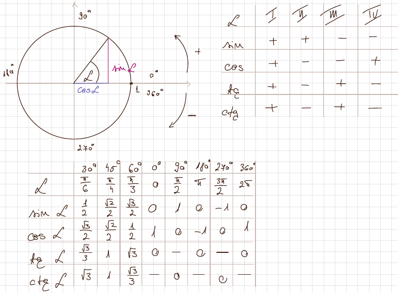
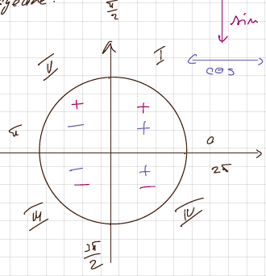

- Összeg és különbség

  - $\sin(a+b) = \sin a\cos b + \cos a\sin b$
  - $\sin(a-b) = \sin a\cos b-\cos a\sin b$
  - $\cos(a+b)=\cos a\cos b-\sin a\sin b$
  - $\cos(a-b)=\cos a\cos -\sin a\sin b$
  - $\tg(a+b) = \frac{\tg a +\tg b}{1-\tg a*\tg b}$
  - $\tg(a-b) = \frac{\tg a-\tg b}{1+\tg a*\tg b}$

- Összeg szorzattá alakítása

  - $\sin x+\sin y=2\sin\frac{x+y}{2}\cos\frac{x-y}{2}$
  - $\sin x-\sin y = 2\cos\frac{x+y}{2}\sin\frac{x-y}{2}$
  - $\cos x + \cos y = 2\cos\frac{x+y}{2}\cos\frac{x-y}{2}$
  - $\cos x - \cos y = -2\sin\frac{x+y}{2}\sin\frac{x-y}{2}$

- Szorzat összeggé alakítása

  - $\sin a*\cos b = \frac{1}{2}[\sin(a+b)+\sin(a-b)]$
  - $\cos a*\cos b = \frac{1}{2}[\cos(a+b)+\cos(a-b)]$
  - $\sin a *\sin b = \frac{1}{2}[\cos(a-b)-\cos(a+b)]$

- Fokszám csökkentés

  - $\sin^2a=\frac{1-\cos2a}{2}\xrightarrow{}2\sin^2a=1-\cos2a$
  - $\cos^2a=\frac{1+\cos2a}{2}\xrightarrow{} 2\cos^2a=1+\cos2a$

- Képletek

  - $\sin^2x+\cos^2x=1$
  - $\sin2a=2\sin a*\cos a\\[6pt]$
  - $\begin{aligned}
      \cos2a &= \cos^2a-\sin^2a=(\cos a-\sin a)(\cos a+\sin a)\\
      &= 2\cos^2a-1\\
      &= 1-2\sin^2a
      \end{aligned}$
  - $\tg2a=\frac{2\tg a}{1-\tg^2a}$
  - $\sin a=\frac{2\tg\frac{a}{2}}{1+\tg^2\frac{a}{2}}\qquad\cos a=\frac{1-\tg^2\frac{a}{2}}{1+\tg^2\frac{a}{2}}$

- Inverz trigonometriai függvények  
   a.

  - $ \begin{aligned} \sin x=a&\Rightarrow\arcsin a =x\\
    &\Rightarrow x=(-1)^k\arcsin a +k\pi\end{aligned}$
  - $\begin{aligned}\cos x= a&\Rightarrow \arccos a = x\\
    &\Rightarrow x=\pm\arccos a +2k\pi\end{aligned}$
  - $\begin{aligned}\tg x= a &\Rightarrow\arcctg a = x\\
    &\Rightarrow\ x=\arctg a+k\pi
    \end{aligned}$
  - $\begin{aligned}\ctg x=a&\Rightarrow\arcctg a=x\\&\Rightarrow x = \arcctg a +k\pi \end{aligned}$

  b.

  - $\arcsin(\sin x)=x,\quad x\in[-\frac{\pi}{2};\frac{\pi}{2}]$
  - $\sin(\arcsin x)=x,\quad x\in[-1,1]$
  - $\arccos(\cos x)=x,\quad x\in[0;\pi]$
  - $\cos(\arccos x)=x,\quad x\in[-1,1]$
  - $\arcctg(\tg x)=x,\quad x\in(-\frac{\pi}{2};\frac{\pi}{2})$
  - $\tg(\arctg x) = x,\quad x\in\mathbb{R}$
  - $\arcctg(\ctg x)=x,\quad x\in(0,\pi)$
  - $\ctg(\arcctg x) = x,\quad x\in\mathbb{R}$

- Visszavezetés az első negyedre

  II$\rightarrow$I

  - $\sin x=\sin(\pi-x)$
  - $\cos x =-\cos(\pi-x)$

  III$\rightarrow$I

  - $\sin x =-\sin(x-\pi)$
  - $\cos x = -cos(x-\pi)$

  IV$\rightarrow$I

  - $\sin x = -\sin(2\pi-x)$
  - $\cos x = cos(2\pi-x)$

