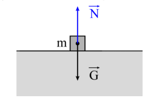
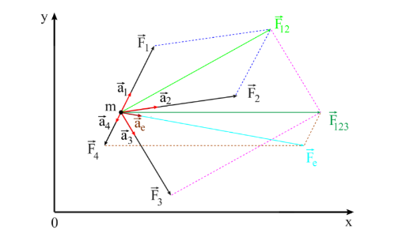

# Dinamika

A Kinematika fejezetben megismerkedtünk a mozgásformákkal és a mozgást időben leíró
mennyiségekkel (helyzet, sebesség, gyorsulás). A továbbiakban az anyagi pont gyorsulásának az
okát az ún. kölcsönhatást és a kölcsönhatási erőkkel kapcsolatos fogalmakat kell bevezessük.

## A dinamika a törvényei (axiómák)

### A tehetetlenég törvénye

Egy test megőrzi viszonylagos nyugalmi állapotát vagy egyenes vonalú egyenletes mozgás
állapotát mindaddig, amig egy másik test (vagy testek) nem kényszeríti mozgásállapotának
megváltoztatására. Ezt nevezzük Newton-féle első axiómának vagy más néven a tehetetlenség
törvényének.
Tehetetlenségnek nevezzük a fizikában a testeknek azon tulajdonságát, hogy ellene
szegülnek minden külső behatásnak, amely az egyenes vonalú egyenletes mozgásállapotot
megváltoztatná, vagy kibillentené a viszonylagos nyugalmi állapotból.
A tehetetlenség törvénye kizárólag a tehetetlenségi vonatkoztatási rendszerekben érvényes
(nem gyorsuló vonatkoztatási rendszer).
A tehetetlenség mértéke a test tömege, amelyet az alapmennyiségek egyike. Jele általában
m vagy M és mértékegysége a kilogramm (kg).

### Impulzus és erő

A mindennapi tapasztalatból mindenki tudja, érezte már azt, hogy mivel jár az, ha egy m
tömegű test mozgásállapota (sebessége) megváltozik valamilyen esemény folytán, vagyis
kölcsönhatás történik (példának okáért leesik valaki valamilyen magasságból és megüti magát).
Nagyon fontos az a tény, hogy a test tömeget és a sebességét egyszerre vegyük figyelembe hiszen, ha a példánkra gondolunk akkor sokkal nagyobb ütést érzünk, ha magasabbról esünk le. E két mennyiség szorzatát impulzusnak nevezzük, általában p-vel jelöljük és ne felejtsük el, hogy a
sebesség jelenléte miatt ez egy vektoriális mennyiség, amelynek az iránya és irányítása megegyezik a sebesség irányával és irányításával és (14.) adja meg a definícióját.

$$
\vec{p} = m\vec{v} \text{ (14.)}
$$

Az impulzus származtatott mennyiség, amelynek a mértékegysége:

$$
[p]_{SI} = [m]_{SI} * [t]_{SI} = 1kg\frac{m}{s}
$$

A testek kölcsönhatásakor megváltozik a testek mozgásállapota és ennek megfelelően az impulzusa is. Mivel a mozgásállapot időben változik meg a kölcsönhatás mértékét az időegység
alatti impulzusváltozás írja le, amely nem más, mint az erőnek nevezett vektoriális mennyiség. A
(15.) összefüggés a kölcsönhatási erő definícióját adja meg.

$$
\lim_{\Delta t\to{0}}\frac{\Delta \vec{p}}{\Delta t}=\frac{d\vec{p}}{dt} = \vec{F} \text{ (15.)}
$$

Abban az esetben amikor a test sebessége jóval kisebb a fénysebességnél, a test tömege
állandónak tekinthető és a (15.) összefüggés a (16.) alakban írható fel.

$$
\vec{F} =\frac{d\vec{p}}{dt} =\frac{d(m\vec{v})}{dt} = m\frac{d\vec{v}}{dt} = m\vec{a} \text{ (16.)}
$$

A (16.) képlet szerint az erő iránya és irányítása megegyezik az általa előidézett gyorsulás
vektor irányával és irányításával, a mértéke pedig annál m-szer nagyobb.
Az erő származtatott mennyiség, amelynek a mértékegysége:

$$
[F]_{SI} = [m]_{SI} * [a]_{SI} = 1kg \frac{m}{s^2} = 1N (Newton)
$$

### Hatás-visszahatás (kölcsönhatás) törvénye

Szintén a mindennapi élet tapasztalataiból tudjuk, hogy ha szilárd talajon állunk, akkor
nem süllyedünk el, tehát a gravitációs tér részéről ható súly erőt a talajnak ki kell egyensúlyozni
egy a testünk súlyának megfelelő ellenerővel. Természetesen hosszan sorolhatnánk még ehhez
hasonló példát, amivel nap mint nap találkozhatunk. Ez az egyszerű kis példa nem más, mint a
dinamika harmadik törvényének, vagy más néven a hatás-visszahatás törvényének egy nagyon
egyszerű megfogalmazása. Általánosan fogalmazva, ha egy A test egy adott irányú és irányítású
erővel hat egy B testre ($\vec{F}_{AB}$) akkor a B test egy ugyanolyan irányú és értékű, de fordított irányítású

erővel hat az A testre ($\vec{F}_{BA}$). A törvény matematikai alakját a (17.) összefüggés szemlélteti.

$$
\vec{F}_{AB} + \vec{F}_{BA} = 0\text{ , vagy } \vec{F}_{AB} = -\vec{F}_{BA}\text{ , vagy skalárisan }F_{AB} = F_{BA}
$$

Szemléltessük a hatás-visszahatás törvényét egy m tömegű anyagi ponttal, amit egy vízszintes felületre helyezünk (az anyagi pontot a szokásos módon egy négyzettel jelöljük, hiszen rajzon kiterjedés nélküli pontot semmiképpen sem tudunk ábrázolni). A gravitációs tér részéről függőlegesen lefele hat a $\vec{G}$ = $m\vec{g}$ súlyerő, míg ezzel ellentétesen felfele hat az ezt kiegyensúlyozó merőleges nyomóerő, $\vec{N}$ = -$\vec{G}$ = $-m\vec{g}$, N = G = mg.

### Az erőhatások függetlenségének törvénye

Egy test egyidejűleg több erő hatásának is ki lehet téve (sőt a valóságban a legtöbb esetben
így van), amelyek a mozgásállapotát (gyorsulását) meghatározzák. A test gyorsulását az
egyidejűleg ható erők paralelogramma szabály szerint meghatározható eredője határozza meg úgy, hogy az egyes erők által kifejtett egyedi hatások nem érzékelhetők.

Abban az esetben amikor a testre n-erő hat egyidejűleg, az eredő erő kifejezését a (18.)
összefüggéssel definiálhatjuk.

$$
\overline{F}_e = \overline{F}_1 + \overline{F}_2 + \dots + \overline{F}_n = \sum_{i=1}^{n}\overline{F}_i \text{ (18.)}
$$

Ha feltételezzük, hogy mindegyik erő a maga gyorsulását eredményezi az (18.)
összefüggést a (19.) alakba írhatjuk át,

$$
m\vec{a}_e = m\vec{a}_1 + m\vec{a}_2 + \dots + m\vec{a}_n = m\sum_{i=1}^{n}\vec{a}_i \text{ (19.)}
$$

vagyis a test gyorsulása

$$
\vec{a}_e =\frac{\overline{F}_1}{m}+\frac{\overline{F_2}}{m}+ \dots +\frac{\overline{F_n}}{m}= \vec{a}_1 + \vec{a}_2 + \dots + \vec{a}_n = \sum_{i=1}^{n}\vec{a}_i \text{ (20.)}
$$

amely azt a tény szögezi le, hogy ha egy testre egyidejűleg több erő hat, az egyidejűleg ható erők
egymás hatását nem befolyásolják, hanem zavartalanul egymásra tevődnek. Ezt a törvényt
nevezzük erőhatások függetlenségének.

### Mozgásegyenletek

Minden összefüggést, amely közvetlenül Newton második törvényére alapozott
mozgásegyenletnek nevezzük. Matematikai alakját a (21.) összefüggés definiálja.

$$
\vec{a} =\frac{d\vec{v}}{dt} =\frac{d^2\vec{r}}{dt^2} =\frac{\vec{F}}{m} \text{ (21.)}
$$