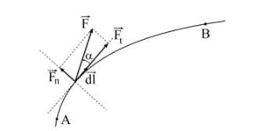

# Mechanikai energia és az energia

## Mechanikai munka

Egy $\vec{F}$ erő elemi $d\vec{l}$ elmozdulás során által végzett mechanikai munkát az erő és az elemi
elmozdulás vektor skaláris szorzataként definiáljuk és az (1.) képlettel, míg egy véges elmozdulás esetében az elemi munka integráljaként adható meg (2.).

$$
dL = \vec{F}d\vec{l} \qquad \text{ 1. }\\
L = \int_A^B \vec{F}d\vec{l} \qquad \text{ 2.}
$$

A két vektor skaláris szorzatának értelmében az (1.) összefüggést dL = F dl cos $\alpha$ alakban
írhatjuk fel, ahol az F cos $\alpha$ = F$_t$ nem más, mint az erő pálya menti (tangenciális) komponense (1.
ábra). Ez az erőkomponens végzi az anyagi pont gyorsítását és ez felelős a mechanikai
munkavégzésért. Ebből következik az a megállapítás, hogy ha az anyagi pontra ható erőnek nincs
a pálya irányába eső komponense (vetülete) akkor az az erő nem végez elmozdítást és ennek
megfelelően mechanikai munkát sem. Az erő pályára merőleges (normális) komponense, F sin $\alpha$ = F$_n$, nem vesz részt a gyorsításban, nem végez mechanikai munkát, azonban fontos szerepe van,
mivel befolyásolja a súrlódási erő mértékét vagy a feszítő erő értékét.

