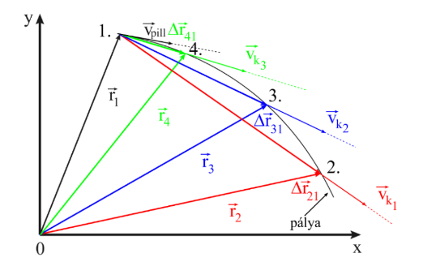
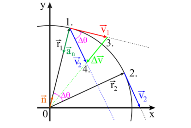
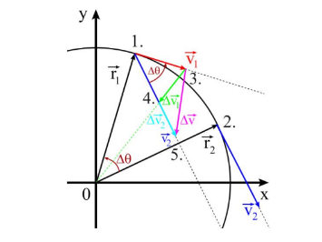
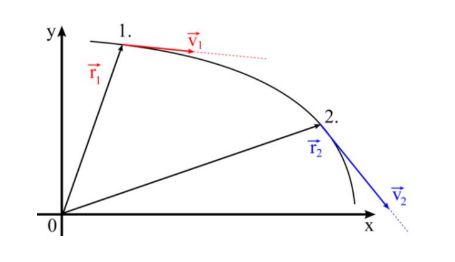
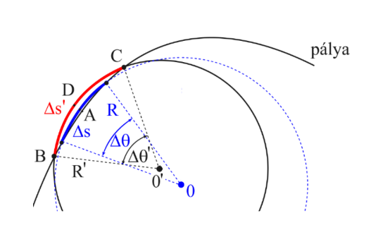
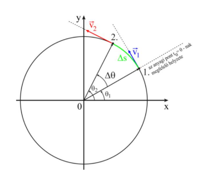

# Kinematika

Egy anyagi pont helyzetének meghatározása után (ld. előző fejezetek) szükségünk van
az anyagi pont helyváltoztatásának leírására. A mechanikának azt a fejezetét, amely az anyagi
pont idő szerinti helyváltoztatását írja le (az erőhatások figyelembevétele nélkül),
kinematikának nevezzük (természetesen ebben az esetben az anyagi pont kinematikájáról
van szó).

## Sebesség

Tekintsünk egy anyagi pontot, amely egy görbe vonalú pályán mozog. A pályán történő mozgást egy kétdimenziós descartes-i koordináta rendszerben írjuk le. A pálya a geometriai pontok összessége, amelyeket az anyagi pont mozgása során érint, esetünkben az 1-es ponttól a 2-es pont felé mozogva. A választott koordináta-rendszerben az anyagi pont helyzetét az $\vec{r}_i$-vel jelzett helyzetvektorok adják meg (i = $\overline{1,4}$).

Mivel a helyváltoztatás időben történik, az a feladatunk, hogy adjuk meg miként változik meg a helyzetvektor ($\Delta\vec{r}$ = $\vec{r}_i$ - $\vec{r}_1$, i = $\overline{2,4}$) egy adott időegység alatt ($\Delta$t). Ezt a mennyiséget jözépsebességnek nevezzük és a definíciója:

$$
\vec{v}_k =\frac{\Delta\vec{r}}{\Delta t}
$$

A sebesség nemzetközi rendszerben elfogadott mértékegysége:

$$
[v_k]_{SI} =\frac{[\Delta r]_{SI}}{[\Delta t]_{SI}}=\frac{1m}{1s}= 1\frac{m}{s}
$$

de lehetőségünk van más mértékegységek bevezetésére, mint például a közlekedési eszközök
sebességére használatos km⁄h.

$$
[v] =\frac{[\Delta r]}{[\Delta t]}= \frac{1km}{1h} =\frac{1000}{3600} (\frac{m}{s}) = \frac{1}{3,6} (\frac{m}{s})
$$

Ez a mozgásra jellemző középsebesség egy „átlag” információt nyújt az anyagi pont
mozgását, helyváltoztatását illetően. Ez sok esetben fontos és elégséges információ lehet.
Például abban az esetben amikor csak arra az információra van szükség, hogy egy autó az A
és B város közötti 100 km-es távolságot (nem utat, amely a pályát jelenti, hanem légvonalban
mért távolságot) 2 óra alatt teszi meg, akkor az autó középsebessége $v_k$ = 100⁄2 =
50 (km⁄h). Mivel két települést általában nem egyenes útszakasz köt össze, a megtett út nem
100 km és nagy valószínűséggel a sebesség sem állandó, így ez az információ nem elégséges,
hiszen nem tudunk pontos információt arról, hogy az autó a mozgás egy adott pillanatban a
pálya meghatározott pontjában mekkora sebességgel rendelkezett.
Az ábra 1-es és 2-es pontja között egy görbült pályaszakaszon mozog az anyagi pont, de a sebességet a $\Delta\vec{r}_{21}$ = $\vec{r}_2$ - $\vec{r}_1$ vektor $\Delta r_{21}$ moduluszával közelítjük meg, ami pontatlan információ. Megfigyelhető az is, hogy ebben az esetben a sebességvektor iránya is a $\Delta\vec{r}_{21}$-nek megfelelő irányítás.

A pálya egyes szakaszaira vonatkozó egyre pontosabb információhoz jutunk abban az
esetben, ha az 1-es ponthoz képest egyre közelebbi pontokat vizsgálunk, így egyre rövidebb
időtartományokban vizsgáljuk a mozgást. Az ábrán először az 1-es és 3-as pontok közötti
pályaszakaszt a $\Delta\vec{r}_{31}$ = $\vec{r}_3$ - $\vec{r}_1$ vektor $\Delta r_{31}$ moduluszával, majd az 1-es és 4-es pontok közötti
pályaszakaszt a $\Delta\vec{r}_{41}$ = $\vec{r}_4$ - $\vec{r}_1$ vektor $\Delta r_{41}$ moduluszával közelítjük meg. Minden esetben
megfigyelhető a számítható sebességvektor irányának változása. Határértékben addig
csökkentjük az időtartamot, amíg $\Delta$t → 0, így ekkor kapjuk a lehető legjobb közelítést az
anyagi pontnak a pálya egy adott pontjában jellemző sebességére. Ezt a sebességet
**pillanatnyi sebességnek** nevezzük, iránya **mindig megegyezik a pálya adott pontjában a
pályához húzott érintő irányával**, irányítása az anyagi pont haladási irányának megfelelő és az alábbi módon definiáljuk.

$$
\vec{v}_{pill} = \vec{v} = \lim_{\Delta t\to\text{0}}\frac{\Delta\vec{r}}{\Delta t}=\frac{d\vec{r}}{dt}
$$

Sok lehetőség áll rendelkezésre ahhoz, hogy a sebesség definícióját átírjuk más
alakba. Lássunk néhányat ezek közül:

$$
\vec{v} = 
\frac{d\vec{r}}{dt}=
\frac{d}{dt}(x\vec{i} + y\vec{j} + z\vec{k}) 
= \frac{dx}{dt}\vec{i} + \frac{dy}{dt}\vec{j} +\frac{dz}{dt}\vec{k} = v_x\vec{i} + v_y\vec{j} + v_z\vec{k} = v\vec{e}_v
$$

ahol $\vec{e}_v$ a sebesség irányába mutató egységvektor és

$$
v_x =\frac{dx}{dt}\\
v_y =\frac{dy}{dt}\\
v_z =\frac{dz}{dt}\\
$$

a sebesség modulusza pedig

$$
v = \sqrt{\vec{v}\vec{v}} = \sqrt{v_x^2 + v_y^2 + v_z^2}
$$

## Gyorsulás

### Általános fogalmak

Mivel egy anyagi pont sebessége mozgása során nem állandó, szükség van egy újabb
mennyiségre, amelyik jellemzi a sebesség időbeli változásának mértékét. Ezt a mennyiséget
gyorsulásnak nevezzük és jellemzi az anyagi pont sebességének egységnyi időtartam alatti
változását. Szükséges megjegyezni azt, hogy az anyagi pont sebessége növekedhet mozgása során tehát gyorsul (ebben az esetben az anyagi pont gyorsulása pozitív) vagy csökkenhet mozgása során tehát lassul (ebben az esetben az anyagi pont gyorsulása negatív). Függetlenül attól, hogy az anyagi pont sebessége növekedik vagy csökken, minden esetben a gyorsulás megnevezést használjuk. Ha a vizsgált időtartam eléggé hosszú akkor az ún. középgyorsulásról beszélünk, melynek a következő a definíciója.

$$
\vec{a}_k = \frac{\Delta\vec{v}}{\Delta t}
$$

A gyorsulás mértékegysége:

$$
[a_k]_{SI} =\frac{[\Delta v]_{SI}}{[\Delta t]_{SI}}=\frac{1m}{\frac{1s}{1s}}= 1\frac{m}{s^2}
$$

Ha az időtartamot megfelelően lerövidítjük $\Delta$t → 0 akkor megkapjuk a pillanatnyi
gyorsulás fogalmát, amelynek következő összefüggés a definíciója.

$$
\vec{a}_{pill} = \vec{a} = \lim_{\Delta t\to\text{0}}\frac{\Delta\vec{v}}{\Delta t}=\frac{d\vec{v}}{dt}
$$

Sok lehetőség áll rendelkezésre ahhoz, hogy a gyorsulás definícióját átírjuk más
alakba. Lássunk néhányat ezek közül:

$$
\vec{a} =\frac{d\vec{v}}{dt}=\frac{d}{dt}(v_x\vec{i} + v_y\vec{j} + v_z\vec{k}) =\frac{dv_x}{d_t}\vec{i} +\frac{dv_y}{dt}\vec{j} + \frac{dv_z}{dt}\vec{k} = a_x\vec{i} + a_y\vec{j} + a_z\vec{k} = a\vec{e}_a
\\\text{vagy}\\
\vec{a} = \frac{d\vec{v}}{dt} =
\frac{d}{dt}(\frac{d\vec{r}}{dt}) =
d^2\vec{r}dt^2 =\frac{d^2x}{dt^2}\vec{i}
+\frac{d^2y}{dt^2}\vec{j} 
+\frac{d^2z}{dt^2}\vec{k} 
= a_x\vec{i} + a_y\vec{j} + a_z\vec{k} = a\vec{e}_a
$$

ahol $\vec{e}_a$ a gyorsulás irányába mutató egységvektor és

$$
a_x = \frac{d^2x}{dt^2}
\\ a_y =\frac{d^2y}{dt^2}
\\ a_z = \frac{d^2z}{dt^2}
$$

a gyorsulás modulusza pedig

$$
a = \sqrt{\vec{a}\vec{a}} = \sqrt{a_x^2 + a_y^2 + a_z^2}
$$

### A gyorsulás értelmezése egyenletes körmozgás esetében. A normális gyorsulás fogalma

Az egyszerűség vagy jobb megértés kedvéért a gyorsulás általános meghatározásának
érdekében kezdjük a tárgyalást egy egyedi esettel, amely az egyenletes körmozgás esete.
A továbbiakban majd ezt általánosítjuk ahhoz, hogy egy szabálytalan alakú ám törésmentes pályán
végbemenő mozgás esetén megadhassuk a pontos definíciót.
Az ábrán az anyagi pont egy R sugarú körpályán az 1-es ponttól a 2-es pont felé állandó
értékű sebességgel halad, tehát |$\vec{v}_1$| = |$\vec{v}_2$| = v. Annak ellenére, hogy a sebesség értéke állandó,
mégis van sebességváltozás vektoriális szinten, hiszen a $\vec{v}_1$ és a $\vec{v}_2$ vektorok más iránnyal és
irányítással rendelkeznek. Ez egy olyan fajta gyorsulást eredményez, amely nem vezet a sebesség
értékének változáshoz. A szerkesztéshez a $\vec{v}_2$ vektort önmagával párhuzamosan eltoljuk a $\vec{v}_1$ vektor kezdőpontjába, majd a háromszögszabálynak megfelelően meghúzzuk a $\Delta\vec{v}$ = $\vec{v}_2$ - $\vec{v}_1$ vektort a $\vec{v}_1$ csúcspontjától a $\vec{v}_2$ csúcspontjáig irányítva.
Az anyagi pont gyorsulása

$$
\vec{a} = \lim_{\Delta t\to\text{0}}\frac{\Delta\vec{v}}{\Delta t}
$$

Látható az ábrán, hogy a sebességváltozás és ennek megfelelően a gyorsulás iránya
megegyezik a sugár irányával irányítása pedig a kör középpontja felé mutató. Ezt a gyorsulást
normális gyorsulásnak nevezzük és $a_n$-el szokás jelölni.

Mivel az 1-es pontra mutató helyzetvektor és az 1-es ponthoz húzott érintő, illetve a 2-es
pontra mutató helyzetvektor és a 2-es ponthoz húzott érintő merőleges szárú szögeket zárnak be,
az 1-es pontban látható két sebességvektor és a két helyzetvektor között ugyanaz a $\Delta\theta$ szög
található. Ezért a 3 - 1 - $4_\Delta$-ben $\Delta$ v ~= v$\Delta\theta$ és az 1 - 0 - $2_\Delta$-ben $\Delta$s = R$\Delta\theta$. Ennek megfelelően
a gyorsulás modulusza

$$
a = a_n = 
\lim_{\Delta t\to\text{0}}\frac{\Delta v}{\Delta t}= \lim_{\Delta t\to\text{0}}\frac{v\Delta \theta}{\Delta t}= v\lim_{\Delta t\to\text{0}}\frac{\Delta s}{\Delta t}\lim_{\Delta s\to\text{0}}\frac{\Delta\theta}{\Delta s}= v\frac{1}{R}v = \frac{v^2}{R}
$$

### A gyorsulás értelmezése egyenletesen változó körmozgás esetében. A tangenciális gyorsulás fogalma.

Abban az esetben, amikor az anyagi pont úgy mozog a körpályán, hogy a sebessége
egyenletesen változik az előző alcímben leírtakat ki kell egészíteni. A kiegészítéshez a kiindulást
az ábra szemlélteti. A szerkesztés ugyanúgy történik, mint az előző alcímben, de az eredmény
annyiban különbözik, hogy a $\Delta\vec{v}$ vektor iránya már nem egyezik meg a sugár irányával (már nem
az 0-pontra mutat). Ezt a $\Delta\vec{v}$ sebességkülönbség-vektort viszont felbonthatjuk két komponensre
(vagy két komponens összegeként tekinthetjük), ezekből az egyik a sugár irányában az 0-pontra
mutató $\Delta\vec{v}_1$ komponens (megegyezik az előző alcímben bevezetett $\Delta\vec{v}$-vel), amelynek
következménye a már bevezetett normális gyorsulás, a másik pedig a pálya érintőjének irányába
eső $\Delta\vec{v}_2$ komponens. Ennek kell a továbbiakban értelmezést adjunk.

Az anyagi pont gyorsulása az alábbi összefüggéssel adható meg.

$$
\vec{a} = \lim_{\Delta t\to{0}}\frac{\Delta\vec{v}}{\Delta t}= \lim_{\Delta t\to{0}}\frac{\Delta\vec{v}_1 + \Delta\vec{v}_2}{\Delta t}= \lim_{\Delta t\to{0}}\frac{\Delta\vec{v}_1}{\Delta t}+ \lim_{\Delta t\to{0}}\frac{\Delta\vec{v}_2}{\Delta t}= \vec{a}_n + \vec{a}_t
$$

ahol $\vec{a}_t$ az ún. tangenciális gyorsulás, amely a sebesség értékének a növekedését/csökkenését
okozza.

$$
\vec{a}_t = \lim_{\Delta t\to{0}}\frac{\Delta\vec{v}_2}{\Delta t}
$$

A tangenciális gyorsulás iránya megegyezik az illető pontban a pályához húzott érintő
irányával. Ha nő a sebesség értéke akkor az irányítása megegyezik a mozgás irányításával, ha
pedig csökken akkor azzal ellentétes.

$$
at = |\vec{a}_t| = \lim_{\Delta t\to{0}}\frac{|\Delta\vec{v}2|}{\Delta t}=\frac{dv}{dt}
$$

### A gyorsulás értelmezése általános esetben. Görbületi sugár értelmezése.

Abban az esetben, amikor a pálya görbevonalú de nem körpálya, a sebességre vonatkozó megállapításaink igazak, tehát a görbe minden egyes pontjában a pillanatnyi sebesség iránya megegyezik az illető ponthoz húzott érintő irányával (ne tévesszen meg senkit az, hogy az ábrán az 1-es és 2-es pontokban a sebességvektorok nem merőlegesek a helyzetvektorokra, egyik sem „kör sugár”!).

Az eddigiekben használt „sugár” fogalma nem elegendő, hiszen az csak a kör esetében
használatos. Ezt a fogalmat ki kell terjesszük úgy, hogy csak a görbe egy adott pontjának
környezetét vizsgáljuk. Az ábrán látható egy görbevonalú pálya, amelynek az A pont
körüli közvetlen környezetét vizsgáljuk. Tekintünk egy R' sugarú kört, amely az A ponthoz képest
szimmetrikusan elhelyezkedő B és C pontokban metszi a görbét. Látható, hogy a $\angle{BDC}$ ($\Delta$s')
hosszúsága nem egyenlő $\angle{BAC}$ ($\angle$ = szög) pályaív hosszúságával. Közelítjük a B és C pontokat az A ponthoz úgy, hogy közben a D pont is közeledjen az A ponthoz. Ebben az esetben a $\angle{BDC}$ körív már egy nagyobb sugarú körhöz tartozik, amely az ábrán R-el van jelölve. Ezt a folyamatot folytatjuk mindaddig, amig a D pont fedésbe kerül az A ponttal, tehát a kör érinti az A pontban görbevonalú pályát és a körív hosszúsága $\Delta$s → 0. Ennek matematikai kifejezést adunk a következő összefüggéssel, amely megadja a görbevonalú pálya egy adott pontjában értelmezett görbületi sugár definícióját (3.).

$$
\lim_{\Delta s\to{0}}\frac{\Delta\theta}{\Delta s}=\frac{1}{R} \text{ (3.)}
$$

## Az anyagi pontra vonatkozó mozgástörvények

### Egyenes vonalú egyenletesen változó mozgás

Az anyagi pont mozgástörvényeit a sebesség és a gyorsulás definícióiból vezethetjük le.
Mivel egyenes vonalú mozgásról van szó, egydimenziós koordináta-rendszert fogunk tekinteni és
a szokásos jelöléseket használva az x-tengely mentén történő mozgást fogunk tekinteni.

$$
v =\frac{dx}{dt}\text{ és } a =\frac{dv}{dt} \text{ (4.)}
$$

### Sebességtörvény

Az anyagi pont sebességtörvényét a gyorsulás definíciójából, integrálás útján vezethetjük
le, ahol $v_0$ a sebesség a $t_0$ kezdeti pillanatban és az a gyorsulás állandó.

$$
\int_{v_0}^{v}dv =\int_{t_0}^{t}adt=a\int_{t_0}^{t}dt\\
v - v_0 = a(t - t_0) => v = v_0 + a(t - t_0) \text{ (5.)}
$$

**Megjegyzés:** attól függően, hogy ki hogyan értelmezi a kezdeti feltételek megjelenítését ebben az
egyenletben több alakban is használatos a sebességtörvény. Abban az esetben, amikor a kezdeti időpillanatot nullának tekintjük $t_0$ = 0, az egyenletből egyszerűen elhagyjuk a $t_0$-t és a következő alakban írjuk fel v = $v_0$ + at. Van olyan forma is, amikor az eltelt időtartamot t - $t_0$ = $\Delta$t-vel
jelöljük v = $v_0$ + a$\Delta$t.

### Mozgástörvény

Az anyagi pont mozgástörvényét a sebesség definíciójából, integrálás útján vezethetjük le,
ahol $x_0$ és $v_0$ a hely-koordináta és sebesség a $t_0$ kezdeti pillanatban és az a gyorsulás állandó.

$$
\int_{x_0}^{x}dx = \int_{t_0}^{t}vdt= \int{t_0}^{t}(v_0 + at)dt = \\ v_0\int_{t_0}^{t}dt+a\int_{t_0}^{t}tdt = \\ v_0(t-t_0) + a\frac{(t-t_0)^2}{2}
\\
x-x_0 = v_0(t-t_0)+a\frac{(t-t_0)^2}{2}\text{ (6.)}
$$

Megjegyzés: attól függően, hogy ki hogyan értelmezi a kezdeti feltételek megjelenítését ebben az
egyenletben több alakban is használatos a mozgástörvény. Abban az esetben, amikor a kezdeti
időpillanatot és a kezdő koordinátát nullának tekintjük $t_0$ = 0 és $x_0$ = 0, az egyenletből egyszerűen elhagyjuk a $t_0$-t és $x_0$-t és az egyenletet a következő alakban írjuk fel x = $v_0$ t + $a\frac{t^2}{2}$.
Van olyan forma is, amikor az eltelt időtartamot t - $t_0$ = $\Delta$t = t-vel és a megtett utat x - $x_0$ =
$\Delta$x = d jelöljük, akkor az egyenletet a $\Delta$x = $v_0\Delta$t +$a\frac{\Delta t^2}{2}$ vagy d = $v_0$ t + $a\frac{t^2}{2}$ alakban írhatjuk fel.

### Egyenes vonalú egyenletes mozgás

Az egyenes vonalú egyenletes mozgásra vonatkozó mozgástörvényeket egyszerűen az
egyenesvonalú egyenletesen változó mozgásra vonatkozó mozgástörvényekből az a = 0
helyettesítéssel származtathatjuk.

$$
v = állandó \\ és \\ d = vt
$$

### Egyenletesen változó körmozgás

Az egyenletesen változó körmozgásra vonatkozó mozgástörvényeket a sebesség és a gyorsulás
definícióiból (4.) kiindulva vezethetjük le úgy, hogy bevezetünk néhány új mennyiéget a
körmozgás sajátosságainak figyelembevételére

Az ábrán az anyagi pont egy R sugarú körön a $t_0$ = 0 pillanatban az 1.-es pontban $v_1$
sebességgel halad és az 0-1. egyenes $\theta_1$ szöget zár be a vonatkoztatási rendszer x-tengelyével.
Tegyük fel, hogy az anyagi pont $\Delta$t idő múlva már a 2.-es pontban található, ahol a sebessége már
$v_2$ > $v_1$. Ez idő alatt a z anyagi pont által megtett út megegyezik a $\Delta$s körív hosszúságával. A
középponti szög mértékének definícióját felhasználva $\Delta$s = R($\theta _2$ - $\theta _1$) = R$\Delta\theta$. Ha $\Delta$t → 0 akkor

ds = Rd$\theta$. Differenciáljuk ezt az egyenletet és kapjuk az (7.) összefügést.

$$
\frac{ds}{dt} = R\frac{d\theta}{dt} \text{ (7.)}
$$

ahol ds⁄dt nem más, mint az anyagi pont (kerületi) sebessége, a jobb oldalon lévő d$\theta$⁄dt
mennyiség pedig az anyagi pont x-tengelyhez viszonyított azimutális helyzetének idő szerinti
változását írja le, amit szögsebességnek (vagy körfrekvenciának) nevezünk és $\omega$-val jelöljük (8.).

$$
\omega =\frac{d\theta}{dt} \text{ (8.)}
$$

így az anyagi pont kerületi sebességét (9.) összefüggéssel számíthatjuk ki.

$$
v = R\omega \text{ (9.)}
$$

A szögsebesség mértékegysége:

$$
[\omega]_{SI} =\frac{[\theta]_{SI}}{[t]_{SI}}= 1\frac{rad}{s}
$$

Az anyagi pont (4.)-nek megfelelő tangenciális gyorsulást megadó képletébe
behelyettesítjük a (9.) összefüggést.

$$
a_t = a = \frac{dv}{dt} =\frac{d}{dt}(R\omega) = R\frac{d\omega}{dt} = R\beta \text{ (10.)}
$$

ahol $\beta$ az anyagi pont szöggyorsulása,

$$
\beta =\frac{d\omega}{dt} \text{ (11.)}
$$

és a mértékegysége

$$
[\beta]_{SI} =\frac{[\omega]_{SI}}{[t]_{SI}}= 1\frac{rad}{s^2}
$$

A sebességtörvény levezetéséhez a (5.) összefüggésből indulunk ki úgy, hogy $t_0$ = 0
helyettesítünk, majd az összefüggést elosztjuk a pályasugárral és megkapjuk az egyenletesen
változó körmozgás sebességtörvényét (12.), ahol $\omega_0$ a kezdeti szögsebesség.

$$
\frac{v}{R}=\frac{v_0}{R}+\frac{a}{R}t => \omega = \omega_0 + \beta t \text{ (12.)}
$$

A mozgástörvény levezetéséhez a (6.) összefüggésből indulunk ki úgy, hogy $t_0$ = 0
helyettesítünk, majd az összefüggést elosztjuk a pályasugárral és megkapjuk az egyenletesen
változó körmozgás mozgástörvényét (12.), ahol $\omega_0$ a kezdeti szögsebesség és (x - $x_0$)⁄R az 1. és pontok közötti középponti szöget jelenti (előző ábra).

$$
\frac{x - x_0}{R}=\frac{v_0}{R}t +\frac{a}{R}\frac{t^2}{2} => \Delta\theta = \omega_0t + \beta\frac{t^2}{2} \text{ (13.)}
$$